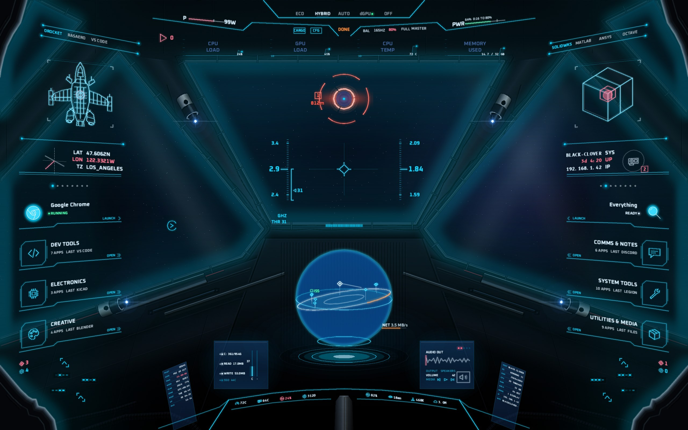
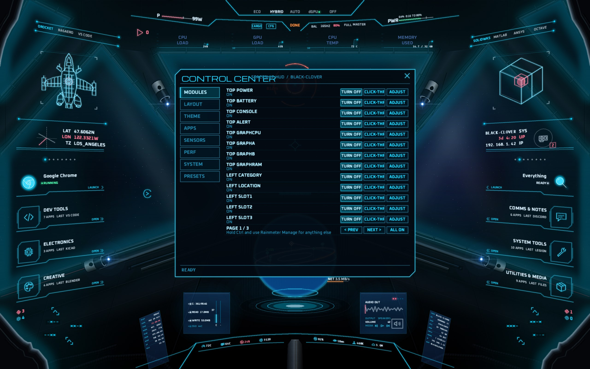

# Spaceship HUD for Rainmeter

A full-screen starship cockpit for the desktop, laid out after a Star Citizen-style canopy reference. The cockpit hull, struts and dashboard frame the screen, and **tinted windows look out onto your own animated space wallpaper** (Lively).

The ship is **symmetric**: the left side is designed and mirrored, and so is the HUD. Every right-hand widget is the mirror image of its left twin. The window shapes come from the owner's line drawing (`art/window-lines-right.png`). The look comes from real sci-fi cockpit renders:

- gunmetal struts with rounded shading;
- window frames with gaskets, bolts and rim light;
- lit window sills, and side walls with grab handles and blue LED banks;
- a centre console with a hologram projector well;
- corrugated floor hoses;
- panel plating and fine scratches;
- angular visor cut-offs at all four corners, traced from the reference (silver-blue rim, stepped notch);
- window edges with tube rails, sagging cables, clamps, lamps built like the reference (a grey cylinder with a hole, a black cylinder, a polished ring and a black cone the light shines from) and a red sill strip;
- smooth A-pillars with long glossy streaks, lower walls with long reflections, a slatted console face and a metal pedestal.

The neutral metal is **pre-rendered into one textured image** (`Images/hull.png`), with brushed-metal streaks, grime, cavity shading and relief lighting. Its windows are cut out with a mask (`Images/window_mask.png`). Rainmeter draws that in one call. Only the theme-coloured parts stay as live Shape meters, so colour themes still apply: rim glow, LEDs, strut lights and HUD lines.

On the glass there are no boxes. Instead:
- a theme-coloured tint;
- faint smudges and reflections;
- optional scanlines;
- **soft dark tints** where the HUD sits, so text stays readable over any wallpaper.

If you'd rather use a picture of the ship, an **image mode** cuts the windows out of any cockpit picture (see below). Every instrument is a live widget sitting where its counterpart sits in the reference:

- system telemetry
- GPU-mode control for the Legion laptop
- app launchers that hold a single app or a whole category
- a 3D radar sphere
- and more.



*Rendered offline by `tools/rmsim.py` with mock sensor data. The background is a stand-in starfield; on your PC it is your Lively wallpaper. Animated parts:*

- *the target lock rotates, breathes and zooms in on a new target*
- *the sphere spins, with an orange sweep and drifting blips*
- *the HUD ladders scroll smoothly*
- *the category wireframes have a scan line*
- *the waveform is live*
- *the warning triangle blinks*

## Install

1. Install [Rainmeter](https://www.rainmeter.net/) 4.5 or newer.
2. Download [`release/Spaceship_HUD_1.0.0.rmskin`](release/Spaceship_HUD_1.0.0.rmskin), double-click it and press **Install**. It loads the `Spaceship` layout.
3. Follow the one-time steps in [`SETUP.txt`](Skins/Spaceship/@Resources/Docs/SETUP.txt). The same guide opens from Control Center → SENSORS → HOW TO. The steps are:
   - Set Rainmeter to "Power saving" GPU.
   - Make the taskbar transparent or auto-hide.
   - Turn on HWiNFO gadget reporting.
   - Enable the Legion Toolkit CLI.

## External monitors

The HUD is drawn for the laptop's own 2560x1600 panel, and it stays there:

- **External monitor connected:** nothing breaks. The Controller finds the 2560x1600 panel among Rainmeter's monitors and keeps every module on it, even if Windows makes the external monitor primary or places it to the left.
- **Nothing on the other screen:** the HUD never spreads onto, or appears on, any other monitor.
- **Laptop panel not connected** (lid closed, external monitor only): the HUD hides, then returns when the panel comes back.
- **Pinning a monitor:** `HomeMonitor` and `HomeSize` in `Settings.inc` choose which monitor the HUD uses. The default is `HomeMonitor=auto` with `HomeSize=2560x1600`.

## What's where

| Area | Shows |
|---|---|
| Top-left / top-right bars | Power draw (W) · battery % filling from the right, with time to the 80% limit or time to empty |
| Top console | GPU modes **ECO / HYBRID / AUTO / dGPU / OFF**, plus power mode, refresh rate, 80% charge limit, graphics tier, dGPU light, CARGO drawer, MASTER kill switch and Control Center |
| Four top graphs | CPU (fixed) · two selectable graphs (click the title to change the source) · RAM (fixed) |
| Side columns, top | Two **category panels** (Rocketry & Aero, Engineering & Analysis): app tabs, a hollow neon wireframe and LAUNCH. Page dots switch the category. |
| Side columns, middle | Location (LAT/LON) · ship identity card (BLACK-CLOVER specs, uptime, IP) |
| Side columns, slots 1-8 | Four identical **buttons** per side, mirrored on the right and set in perspective. A single app launches; a category opens a pop-up list of its apps (right-click launches the last one used). A folder button shows one neon emblem for the whole folder, with room around it. Every single-app button shows the app's **own icon in neon**: the real icon is recoloured from the theme colour to white, with a glow. |
| Side columns, bottom | Upkeep (Windows Update, winget, antivirus) · dev status (WSL, Ollama, Tailscale) |
| Centre | Orange target lock on the busiest process · flight HUD (clock, CPU GHz tape, GPU tape, fan/throttle readout, network variometer, **next rocket launch countdown**) · 3D radar sphere with a tilted disk and a level one crossing it (process blips, **ISS position**, your position) |
| Dash | Storage screen · audio screen (live waveform, volume, media keys) · four info cells either side of the dash arc (temperatures, load, fan · network, ping, Wi-Fi) |
| Tilted corner screens | Nine readouts on each pane, angled with it. Left: pilot (your Windows user), date, live time, week, year progress, UTC offset, boot time, uptime and idle time. Right: host, Windows, display, CPU threads, memory, OS bits, monitors, IP address and Wi-Fi network |
| Overlays | **CARGO** drawer (every category as a drop-down) · **Control Center** |



## Adjusting it (Aurum-style)

The Control Center (the CFG button, or right-click any module) has these tabs:

- **MODULES:** turn any module on or off, and make it click-through.
- **LAYOUT:** nudge modules. A **layout guard** blocks any move that would overlap another module, a strut or the taskbar band. Also: edit mode, scale and auto-fit.
- **THEME:** colour presets, window tint, glow, line cores and text glow, glass glare, scanlines, the transparency controls, and the cockpit art (rendered hull or your picture). The metal tones are `HullDark` / `HullMid` / `HullLight` / `HullEdge` in `Settings.inc`; run `tools/ship_frame.py` to re-bake after changing them.
- **APPS:** reassign the 2 panels and 8 slots, rescan the Start menu, edit the catalog.
- **SENSORS:** auto-map HWiNFO sensors.
- **PERF:** performance-tier thresholds and the MASTER switch.
- **SYSTEM:** lock, sleep, restart and shut down (with confirmation), and Settings shortcuts.
- **PRESETS:** six save slots, with **undo**.

Apps live in [`Apps.ini`](Skins/Spaceship/@Resources/Apps.ini). Targets resolve against your Start menu, so apps that aren't installed yet stay hidden until they are. **Ansys** sits in the Engineering panel next to SolidWorks and MATLAB. It's found by its Start menu name (Workbench, Ansys, Ansys Student, Mechanical or Fluent) or by the default install paths (v241 to v261, including Student).

### Apps that aren't installed

Nothing breaks if some apps in the catalog aren't on your PC:

- **In a folder:** a missing app is left out of the folder's list, the top panels and the CARGO drawer. Set `HideMissing=0` in `Apps.ini` to list it greyed out instead.
- **Whole folder missing:** if none of a folder's apps are installed, the folder still shows, marked **NONE INSTALLED**. Its top panel shows the folder's hologram dimmed, with the same note.
- **Single-app slot** (Chrome, Everything): a missing app is marked **NOT FOUND** in orange. Clicking it launches nothing.
- **What a click on a missing app does:** it writes the reason to the Rainmeter log, then asks the Controller to rescan the Start menu (at most once a minute). An app you just installed appears without a manual refresh.
- **No real icon:** an app whose icon couldn't be extracted falls back to its line icon.

The Start menu is also rescanned on first run, then daily.

Errors don't freeze the HUD either. Every module's update and mouse handlers run protected: an error is written once to the Rainmeter log (*Manage > Log*, `Spaceship error in ...`), and the module keeps running.

## Glow and look

Every line on the HUD, and the cockpit's own HUD lines, use the same three-layer neon bloom:

1. a wide, faint halo;
2. a glow in the theme colour;
3. the line itself, with a white-hot core (`CoreWhite`).

Bright dots get a soft halo. Text carries a blurred glow in its own colour (`TextGlow`, a zero-offset `InlineSetting=Shadow`). Every strength lives in `Settings.inc` and in Control Center → THEME. The glow switches itself off on the LOW and STEALTH performance tiers.

Fonts: **Oxanium** for labels, **B612 Mono** for numbers (B612 was designed by Airbus for its cockpit displays) and **Michroma** for titles.

### Transparency

| Setting (Control Center → THEME) | What it does |
|---|---|
| `HullAlpha` (HULL OPACITY) | Opacity of the metal: 255 is solid, lower lets the wallpaper show through the ship |
| `ShadeAlpha` (DARK TINTS) | Strength of the soft dark tints on the glass behind the HUD (0 turns them off) |
| `HudAlpha` (HUD OPACITY) | Opacity of every HUD line and label |
| `GlassTint` (WINDOW TINT) | Theme-colour tint on the windows |
| `GlassGlare` (GLASS GLARE) | Smudges and reflections on the glass |
| `MistAlpha` | The neon mist glowing off every edge of the glass (sides, sills, top, corner cuts); 0 turns it off, lower values soften it |
| `ScanLines` / `ScanAlpha` (SCANLINES) | Scanlines on the glass |

### Using a picture of the ship

The rendered hull is clean and symmetric, but a photo-quality render has more detail still. If you have a picture of the cockpit (ship only, or with space in the windows), run this to scale it to 2560×1600 and cut the windows out along the reference window shapes with a soft edge:

```
python tools/image_frame.py my-cockpit.png
```

Then pick Control Center → THEME → COCKPIT ART → PICTURE (`UseShipImage=1`). A PNG with its own transparent windows keeps them. The glass tint, glare, scanlines, dark tints and HUD lines stay on top, and the rendered hull, strut lights and LEDs hide.

## Performance

The HUD lowers its own detail as GPU load rises (**FULL → LITE → LOW → STEALTH**), with hysteresis and a minimum tier on battery:

- The sphere and waveform slow down, then freeze, then hide.
- The glow passes switch off.
- Each module is its own skin with its own update rate.
- Hidden modules stop running entirely.
- Telemetry uses Windows performance counters, which don't wake the sleeping RTX 5070.

## How it's built

```
tools/ref_layout.py     every zone, window and hull outline traced from the reference image -> layout.json
layout/layout.json      generated: zones (with slant quads), windows, decor, taskbar band
tools/check_layout.py   overlap / safe-area / taskbar checks on the slanted shapes (+ preview image)
art/window-lines-right.png   the owner's window drawing (right half; mirrored for the left)
tools/ship_frame.py     the symmetric cockpit: glass, shaded hull, frames, detail, lights -> Frame/Parts/*.inc + Frame.ini order
tools/frame_render.py   bakes the neutral metal into Images/hull.png (texture, relief, plating, stencils) + window_mask,
                        glass_fx, scan and shade images
tools/image_frame.py    image mode: cuts the windows out of a cockpit picture -> @Resources/Images/ship.png
tools/build.py          writes each module's Geometry.inc / Meters.inc and the guard data
tools/rmsim.py          offline Rainmeter simulator: runs the real Lua, renders, audits alignment
tools/anim_audit.py     steps the animated modules frame by frame and audits every frame
tools/package.py        builds the .rmskin installer and the Rainmeter layout
Skins/Spaceship/        the skin set (Lua in @Resources/Scripts, settings in @Resources/*.inc)
```

After editing the layout, run: `python tools/ref_layout.py && python tools/build.py && python tools/ship_frame.py && python tools/rmsim.py && python tools/package.py`.
The tools need `pip install lupa pillow shapely numpy`.

The full design rationale is in [`docs/PLAN.md`](docs/PLAN.md).

## Credits

- Fonts: Oxanium, B612 Mono, Michroma, Rajdhani, Share Tech Mono and Orbitron (SIL Open Font License; the licences are in `@Resources/Fonts`).
- Ideas were drawn from public Rainmeter work: an F/A-18 cockpit skin (gauges as instruments, a kill switch), Sonder (rocket launches and ISS), Cockpit 1.5 (control panel and rotating target) and Aurum (presets, locks and per-module adjustment).
- Launch data: [The Space Devs](https://thespacedevs.com/). ISS position: [Open Notify](http://open-notify.org/).
